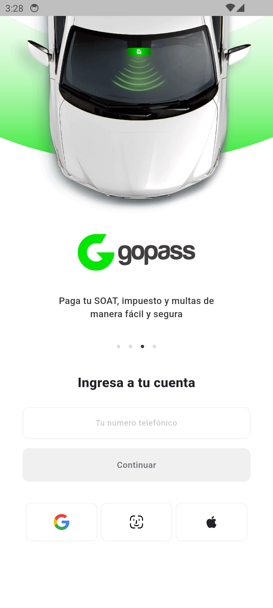

# Flutter Swap Dart — RFW sample

This fork keeps the original Flutter Swap packages and adds a Remote Flutter
Widgets (RFW) onboarding sample under `sample/`.

## Run the sample

<!-- markdownlint-disable MD033 -->

<table width="100%">
  <tr>
    <td width="50%" valign="top">
      
    </td>
    <td width="50%" valign="top">
      
<strong>1. Start the server:</strong>

      <pre><code class="language-sh">cd sample/server</code></pre>
      <pre><code class="language-sh">fvm dart pub get</code></pre>
      <pre><code class="language-sh">PORT=8080 fvm dart run bin/server.dart</code></pre>
      
<strong>2. Run the Android client in another terminal:</strong>

      <pre><code class="language-sh">cd sample/client</code></pre>
      <pre><code class="language-sh">fvm flutter pub get</code></pre>
      <pre><code class="language-sh">fvm flutter emulators --launch Pixel_14</code></pre>
      <pre><code class="language-sh">fvm flutter run -d emulator-5554 \
  --dart-define=RFW_BASE_URL=\
http://10.0.2.2:8080</code></pre>
      
The Android emulator reaches the host server through <code>10.0.2.2</code>.

    </td>
  </tr>
</table>

<!-- markdownlint-enable MD033 -->

## Runtime RFW flow

- `sample/server/lib/src/rfwtxt/screens/gopass.rfwtxt` is the default Gopass
  onboarding screen.
- The server reads and compiles the requested `.rfwtxt` file for every
  request. It does not cache a screen in memory.
- The client downloads the remote `onboarding` library at runtime. Its only
  compiled additions are stable native primitives in
  `sample/client/lib/src/onboarding_local_widgets.dart` for the phone field
  and SVG icons.
- The client advances Gopass every four seconds through `DynamicContent`; the
  server-defined dots can also select a page through RFW events. Input, social
  actions, and the Continue toast do not request or replace the root screen.
- Social controls and Continue use remote RFW Material `InkWell` widgets for
  native hover, press, and splash feedback.

Edit `gopass.rfwtxt` while the server is running, restart the client
application, and the changed onboarding is fetched without rebuilding the
Android client. Gopass remains the initial screen.

Use `GET /rfwtxt?screen=gopass&format=text` to inspect the editable source.
The default endpoint returns RFW's binary library format for transport.

See the focused instructions in [the client README](sample/client/README.md)
and [the server README](sample/server/README.md).
